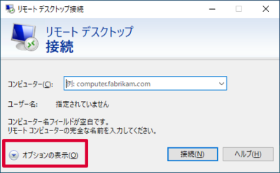
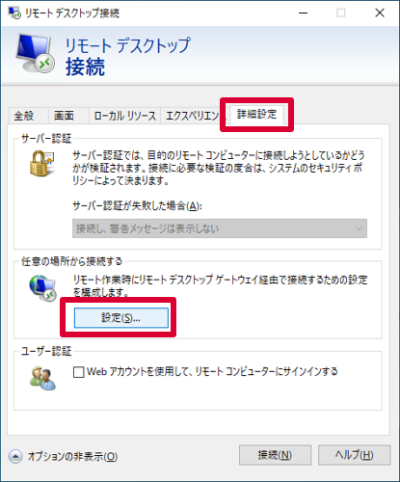

# 接続手順書
- [接続手順書](#接続手順書)
  - [開発用PCへ接続する](#開発用pcへ接続する)
    - [Windowsの人](#windowsの人)
    - [Macの人](#macの人)
  - [アドインの開発を始める](#アドインの開発を始める)

## 開発用PCへ接続する
### Windowsの人
1. スタートメニューを開き、「リモートデスクトップ接続」と検索して開いてください。  
  

1. チームごとに、決められたコンピュータに対して接続します。  
  「コンピューター」に以下アドレスを記入して「接続」を押します。  
    
  __※接続先アドレスはZoomのチャットで連絡します。__
    |チーム|コンピューター|
    |-|-|
    |1|xx.xx.xx.xx|
    |2|xx.xx.xx.xx|
    |3|xx.xx.xx.xx|
    |4|xx.xx.xx.xx|
    |5|xx.xx.xx.xx|
1. 以下ユーザー名とパスワードを入力してOKします。  
  
    |チーム|ユーザー名|パスワード|
    |-|-|-|
    |1|intern1|intern1#####|
    |2|intern2|intern2#####|
    |3|intern3|intern3#####|
    |4|intern4|intern4#####|
    |5|intern5|intern5#####|
1. 開発用PCにログインできました。
### Macの人
1. App Storeを開いて、「Microsoft Remote Desktop」で検索します。  
    出てきたアプリを「インストール」して、インストールが終わったら「開く」を押してください。  
  

1. 最初に聞かれる内容は「Not now」を選択します。  
  

1. 「Add PC」を押します。  
  
1. チームごとに、決められたコンピュータに対して接続します。  
  出てきた画面の「PC name」に以下を入れて、「Add」を押します。  
  __※接続先アドレスはZoomのチャットで連絡します。__
    |チーム|PC name|
    |-|-|
    |1|xx.xx.xx.xx|
    |2|xx.xx.xx.xx|
    |3|xx.xx.xx.xx|
    |4|xx.xx.xx.xx|
    |5|xx.xx.xx.xx|

    
1. 画面上の「」をダブルクリックします。  
  
1. ユーザー名とパスワードに以下を入れて「Continue」を押します。
    |チーム|Username|Password|
    |-|-|-|
    |1|intern1|intern1#####|
    |2|intern2|intern2#####|
    |3|intern3|intern3#####|
    |4|intern4|intern4#####|
    |5|intern5|intern5#####|  

    
1. 以下のようなメッセージが出た場合、「Continue」を押します。  
  
1. 開発用PCにログインできました。

## アドインの開発を始める
1. ここからはチームメンバに開発用PCの画面を共有して進めましょう。
1. 開発用PCでSlackを起動する。  
  Zoomのブレークアウトルームに移動後の、社員との連絡手段として使用します。  
  アカウント・ワークスペース設定済みとなっているはずです。
1. 開発用PCのデスクトップにある「Z」のリンクを開く。  
    |格納ファイルフォルダ名|内容|
    |-|-|
    |Z:\PowerPointアドイン開発手順書.pdf|開発用PCにログインしてから、チュートリアル問題を解くまでの手順書|
1. 「PowerPointアドイン開発手順書.pdf」を開く
1. 手順書を参考に、問題に取り組んでいきましょう！
* (参考)開発用PCには以下ツールが入っています。
  * Office 2016
  * Visual Studio 2019 Community

