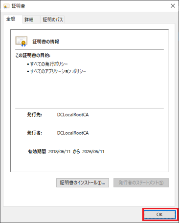

# 接続手順書
- [接続手順書](#接続手順書)
  - [開発用PCへ接続する](#開発用pcへ接続する)
    - [証明書を設定する(windows)](#証明書を設定するwindows)
    - [リモートデスクトップする(windows)](#リモートデスクトップするwindows)
    - [証明書を設定する(mac)](#証明書を設定するmac)
    - [リモートデスクトップする(mac)](#リモートデスクトップするmac)
  - [アドインの開発を始める](#アドインの開発を始める)

## 開発用PCへ接続する

Windowsの人

### 証明書を設定する(windows)
* デンソークリエイト内にある開発用PCにアクセスするための証明書を皆さんのPCに登録します。

1. 証明書をダウンロードします。  
   __※証明書のダウンロードURLはZoomのチャットで連絡します。__
1. ダウンロードしたファイルをダブルクリックして開きます。すると証明書の内容が表示されます。  
   「証明書のインストール」をクリックします。  
    
1. 「次へ」をクリックします。  
  
1. 「証明書をすべて次のストアに配置する」を選択し、「参照」をクリックします。  
  
1. 「信頼されたルート証明機関」を選択し、「OK」をクリックします。  
  
1. 「次へ」をクリックします。  
  
1. 「完了」をクリックします。  
  
1. 「OK」をクリックします。  
  
  

### リモートデスクトップする(windows)

1. 画面を共有しながら進めましょう。  
    接続に詰まった場合に画面を見せながら相談できます。

1. スタートメニューを開き、「リモートデスクトップ接続」と検索して開いてください。  
  

1. チームごとに、決められたコンピュータに対して接続します。  
  まず、接続に必要な RD ゲートウェイ を設定します。  
  「オプションの表示」をクリックします。  
  

1. 「詳細設定」の「任意の場所から接続する」の枠の「設定」をクリックします。  
   

1. 「次の RD ゲートウェイサーバー設定を使用する」にチェックを付け、  
  「サーバー名」を以下の通り入力し、「OK」をクリックします。  
    |項目|入力|
    |-|-|
    |サーバー名|__※サーバー名(=ゲートウェイ名)はZoomのチャットで連絡します。__|  

    

1. 「全般」に戻り、  
  「コンピューター」と「ユーザー名」を以下の通り入力し、「接続」をクリックします。  
    |項目|入力|
    |-|-|
    |コンピューター|__※コンピューター名(=開発PC名)はZoomのチャットで連絡します。 チーム毎に異なるので注意__|
    |ユーザー名|__※ユーザ名はZoomのチャットで連絡します。__|  

    

1. 以下ユーザー名とパスワードを入力してOKします。  
   もし自分のアカウント名がすでに入っている場合は、下のほうにある「その他」→「別のアカウントを使用する」を押してください。  
    |項目|入力|
    |-|-|
    |ユーザー名|__※ユーザ名はZoomのチャットで連絡します。__|
    |パスワード|__※パスワードはZoomのチャットで連絡します。__|  

      
      

2. これで開発用PCにログインできました。  
   接続の練習はここまでです。  
   リモートデスクトップを切断し、次の人に開発用PCに接続してもらいましょう。  

   

Macの人

### 証明書を設定する(mac)
* デンソークリエイト内にある開発用PCにアクセスするための証明書を皆さんのPCに登録します。

1. 証明書をダウンロードします。  
   __※証明書のダウンロードURLはZoomのチャットで連絡します。__
1. ダウンロードしたファイルをダブルクリックして開きます。すると確認のダイアログが表示されるので、  
    キーチェーンを「ログイン」にして「追加」をクリックします。  
    
  もし以下のようなダイアログが出た場合は、  
  各自のPCのログインユーザ名・パスワードを入力して「キーチェーンを変更」してください。  
  
1. 「キーチェーン」ウィンドウの「ログイン」（もしくは「システム」）内に、  
    "DCLocalRootCA" が入っていれば完了です。  
  

### リモートデスクトップする(mac)
1. 画面を共有しながら進めましょう。  
    接続に詰まった場合に画面を見せながら相談できます。

1. App Storeを開いて、「Microsoft Remote Desktop」で検索します。  
    出てきたアプリを「インストール」して、インストールが終わったら「開く」を押してください。  
  

1. 最初に聞かれる内容は「Not now」を選択します。  
  

1. チームごとに、決められたコンピュータに対して接続するための設定をしていきます。  
  最初に、「Add PC」を押します。  
  

1. 接続に必要な"Gateway"を設定します。  
   "Gateway"の欄を開き、「Add Gateway...」をクリックします。  
  

1. GatewayにアクセスするUserを設定します。  
   "User account"の欄を開き、「Add User Account...」をクリックします。  
  

1. UsernameとPassword、Friendly nameを以下の通り入力し、  
   「Add」をクリックします。  
    |項目|入力|
    |-|-|
    |Username|__※Username(=ユーザ名)はZoomのチャットで連絡します。__|
    |Password|__※Password(=パスワード)はZoomのチャットで連絡します。__|
    |Friendly name|dc intern|  

    

1. Gatewayのダイアログに戻るので、それぞれ以下の通り入力し、  
   「Add」をクリックします。  

    |項目|入力|
    |-|-|
    |Gateway name|__※Gateway name(=ゲートウェイ名)はZoomのチャットで連絡します。__|
    |Friendly name|dc intern|
    |User account|dc intern|

    

1. Add PCのダイアログに戻るので、それぞれ以下の通り入力し、  
   「Add」をクリックします。  

    |項目|入力|
    |-|-|
    |PC name|__※PC name(=開発PC名)はZoomのチャットで連絡します。 チーム毎に異なるので注意__|
    |User account|dc intern|
    |Friendly name|dc intern|
    |Gateway|dc intern|

    

1. 作成されたボタンをダブルクリックします。  
  

1. 以下のようなメッセージが出た場合、「Continue」を押します。  
    
  

1. これで開発用PCにログインできました。  
   接続の練習はここまでです。  
   リモートデスクトップを切断し、次の人に開発用PCに接続してもらいましょう。  
  

## アドインの開発を始める

1. チームメンバに開発用PCの画面を共有して進めましょう。

1. 開発用PCでSlackを起動する。  
  Zoomのブレークアウトルームに移動後の、社員との連絡手段として使用します。  
  アカウント・ワークスペース設定済みとなっています。

1. 開発用PCのデスクトップにある「Z」のリンクを開き、  
   「PowerPointアドイン開発演習手順書.pdf」を開く

1. 手順書を参考に、問題に取り組んでいきましょう！

* (参考)開発用PCには以下ツールが入っています。
  * Office 2016
  * Visual Studio 2012
